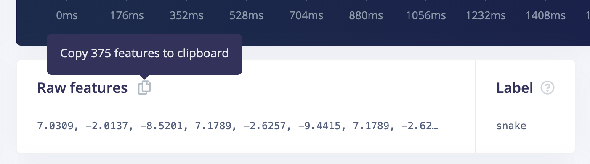

# Custom processing block example (Python)

This is an example of a custom processing block, which you can load in the Edge Impulse studio. See the docs: [Building custom processing blocks](https://docs.edgeimpulse.com/docs/custom-blocks).

1. Install Python 3.12:
2. Create a venv, and install packages (note: you cannot update these, or add new packages - this is a fixed package list for Edge Impulse DSP blocks):

    ```bash
    python3.12 -m venv .venv
    source .venv/bin/activate
    pip3 install -r requirements.txt
    ```

3. In Edge Impulse, go to a DSP page; copy the raw features for a sample, and place in `features.txt`:

    

4. Run the DSP block to ensure your environment is set up correctly:

    ```
    python3 run.py --features features.txt --frequency 62.5 --axes "accX,accY,accZ" --scale-axes 1 --gravity-cutoff 0.7 --filter-order 2 --spectral-window hanning
    ```

    (Update frequency and axes with the frequency/axes of your data sample)

You're now ready to customize this example; and add your own DSP code in `dsp.py`.

## Adding extra parameters

If you have new parameters you want to add to the block:

1. Add them as arguments to `generate_features` in [dsp.py](dsp.py).
2. Also add them to the `parameters` section in `parameters.json`. This will ensure there's UI rendered to configure the new parameters. See the `DSPParameterItem` spec in https://docs.edgeimpulse.com/tools/specifications/files/parameters-json for all options.

`run.py` will automatically pick up new parameters in `parameters.json`.

## Adding graphs

You can add graphs to show e.g. processed state, or intermediary features. See https://docs.edgeimpulse.com/tutorials/topics/feature-extraction/build-custom-processing-blocks#3-implementing-smoothing-and-drawing-graphs.

## Publishing to Edge Impulse

1. Initialize the block:

    ```
    edge-impulse-blocks init --clean
    ```

2. Push the block:

    ```
    edge-impulse-blocks push
    ```

3. Add the block via **Create impulse > Add a processing block**.
